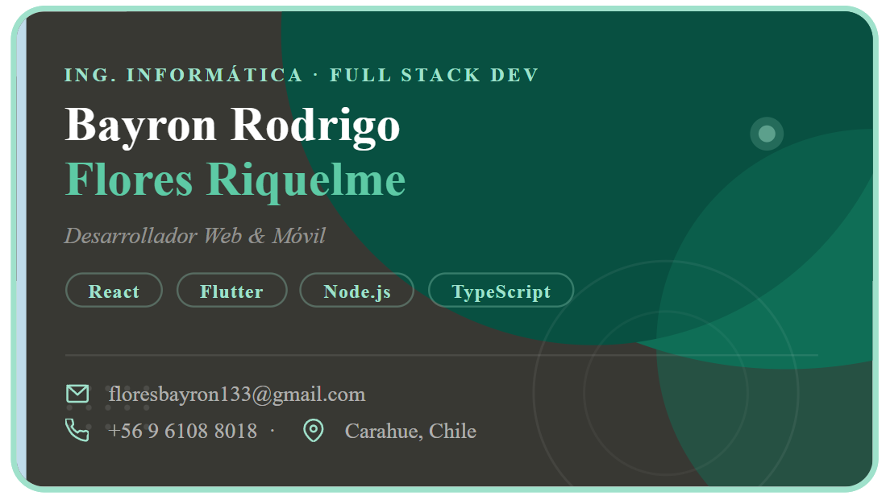
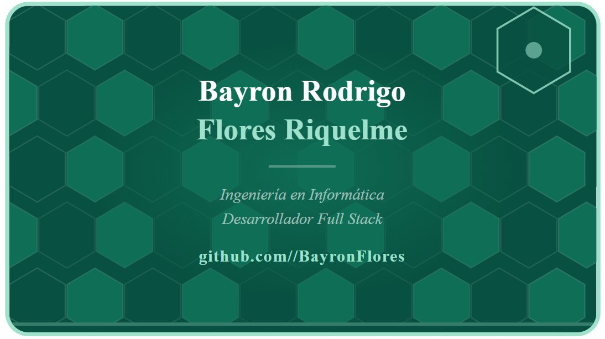

# 💳 Tarjeta de Presentación – Bayron Flores

Diseño moderno y minimalista de tarjeta de presentación para desarrollador Full Stack, con estilo oscuro y acentos en tonos verdes/menta. Ideal para uso digital o impresión.

---

## 🖼️ Vista previa

### 🔹 Cara Frontal



### 🔹 Cara Trasera



> 📌 Puedes reemplazar estas imágenes en la carpeta `/assets` con capturas reales del diseño.

---

## 🎨 Características del diseño

- Estilo moderno y profesional
- Diseño doble cara (front/back)
- Uso de SVG para gráficos dinámicos
- Paleta de colores tecnológica (verde oscuro + menta)
- Tipografía clara y jerarquizada
- Adaptado para:
  - 💻 Uso digital (portafolio)
  - 🖨️ Impresión física

---

## 🧩 Tecnologías utilizadas

- **HTML5**
- **CSS3** (Flexbox + diseño responsive)
- **SVG** (gráficos vectoriales)

---

## 📐 Dimensiones

| Propiedad | Valor                       |
| --------- | --------------------------- |
| Tamaño    | 356px × 200px               |
| Relación  | Tarjeta estándar horizontal |

---

## 🎯 Contenido de la tarjeta

### Frontal

- Nombre completo
- Rol profesional
- Stack tecnológico
- Información de contacto:
  - 📧 Email
  - 📞 Teléfono
  - 📍 Ubicación

### Trasera

- Nombre destacado
- Frase profesional
- Usuario de GitHub

---

## 🎨 Paleta de colores

| Color         | Código    | Uso                    |
| ------------- | --------- | ---------------------- |
| Fondo oscuro  | `#161614` | Base frontal           |
| Verde         | `#0F6E56` | Elementos principales  |
| Verde oscuro  | `#085041` | Fondo trasero          |
| Menta         | `#9FE1CB` | Acentos                |
| Verde claro   | `#E1F5EE` | Información secundaria |
| Acento nombre | `#5DCAA5` | Apellido               |

---

## 📂 Estructura del proyecto

```
📁 tarjeta-de-presentacion/
│
├── Diseño-Targeta.html
├── README.md
└── assets/
    ├── frontal.png
    └── trasera.png
```

---

## 🚀 Cómo usar

1. **Clona el repositorio:**

```bash
git clone https://github.com/BayronFlores/tarjeta-de-presentacion.git
```

2. **Abre el archivo:**

```bash
index.html
```

3. **Visualiza el diseño en tu navegador.**

---
